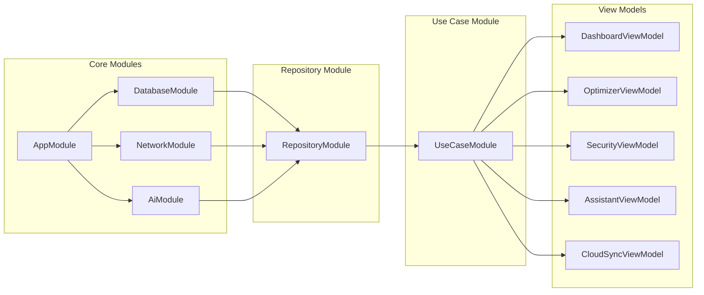
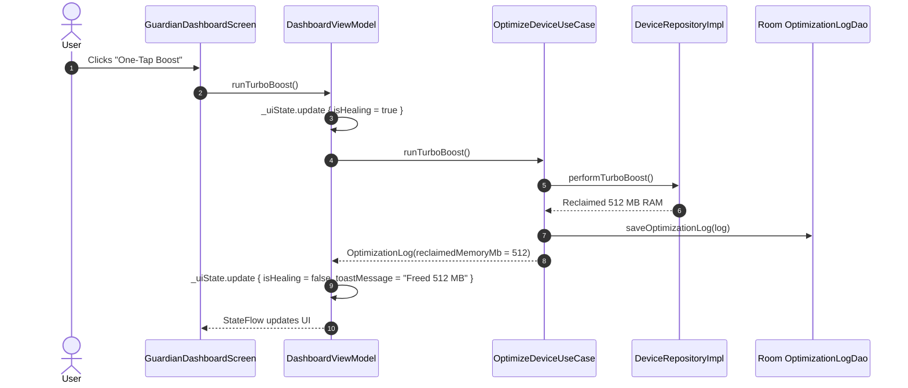
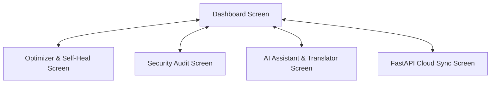

# Clean Architecture Specification - Jelyta Sister's AI Device Guardian

**Package Name:** `com.jelyta.deviceguardian`

This project follows **Enterprise Clean Architecture** principles, strictly separating concerns into decoupled layers: **Domain**, **Data**, **Presentation**, and **Core / DI**.

---

## 📐 Clean Architecture Overview Diagram

```mermaid
graph TD
    subgraph Presentation Layer
        UI[Jetpack Compose Views] --> VM[ViewModels StateFlow/UiState]
    end

    subgraph Domain Layer
        VM --> UC[Single Responsibility Use Cases]
        UC --> RI[Repository Interfaces]
        UC --> DM[Domain Models]
    end

    subgraph Data Layer
        RI <|.. RImpl[Repository Implementations]
        RImpl --> MAP[Entity & Dto Mappers]
        RImpl --> LDS[Room Database & Local DAOs]
        RImpl --> RDS[Gemini REST AI & FastAPI Client]
        RImpl --> HDS[System Hardware Telemetry API]
    end

    subgraph Core & Infrastructure
        AC[AppContainer / DI Modules]
        NAV[Navigation Compose NavHost]
        WM[WorkManager Periodic Health Worker]
        NOTIF[Notification Helper]
    end
```

---

## 🗂️ Dependency Graph



---

## 🔄 Data Flow Sequence Diagram



---

## 🧭 Navigation Flow



---

## 🔒 Security & Enterprise Guarantees
1. **No Service Locator**: Migrated completely to clean modular dependency container (`AppContainer`).
2. **Single Responsibility Use Cases**: Every UseCase lives in its own dedicated file.
3. **Robust Result Wrappers**: Network and storage calls use structured `Result` / `Resource` / `NetworkResult` wrappers.
4. **Entity & Dto Mappers**: Strict isolation between Database Entities, Network DTOs, and Domain Models.
5. **Background Telemetry**: WorkManager background execution for periodic health checks and cloud sync.
